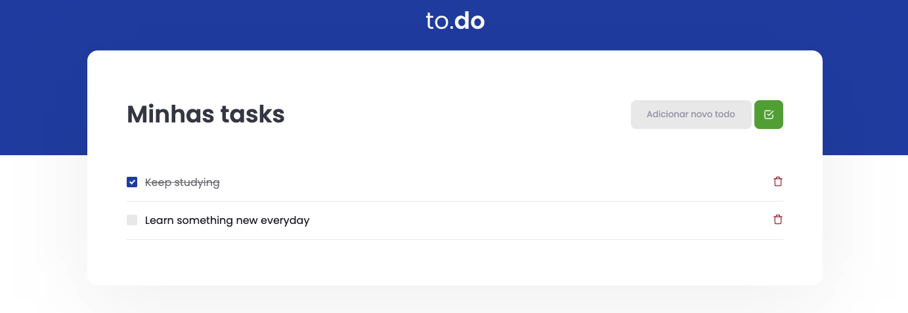

<div id="top"></div>

<br />
<div align="center">
  <h3 align="center">To-do list</h3>

  <p align="center">
    An app to remeber your tasks!
    <br />
    <a href="https://github.com/brunomestanza/ignite-react"><strong>Explore all projects »</strong></a>
  </p>
</div>

<details>
  <summary>Table of Contents</summary>
  <ol>
    <li>
      <a href="#about-the-project">About The Project</a>
      <ul>
        <li><a href="#built-with">Built With</a></li>
      </ul>
    </li>
    <li><a href="#getting-started">Getting Started</a></li>
  </ol>
</details>

## About The Project
<div align="center">
  
</div>
<br/>
<p align="center">A simple app for a todo list<p>
<p align="right">(<a href="#top">back to top</a>)</p>

### Built With

* [TypeScript](https://www.typescriptlang.org/)
* [React.js](https://reactjs.org/)
* [SASS](https://sass-lang.com/)

<p align="right">(<a href="#top">back to top</a>)</p>

## Getting Started

To get a local copy up and running follow these simple example steps.

```
$ git clone https://github.com/brunomestanza/ignite-react
$ cd ignite-react/to-do-list
$ yarn install
$ yarn dev
```